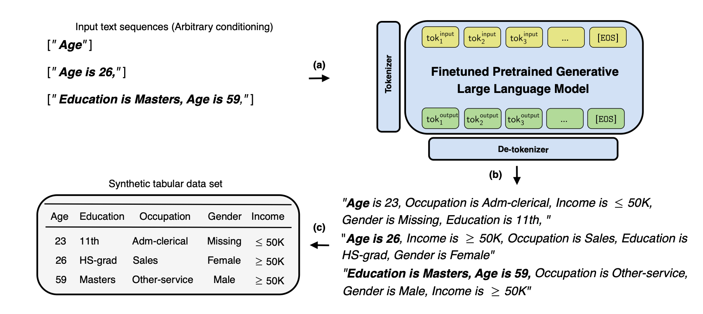
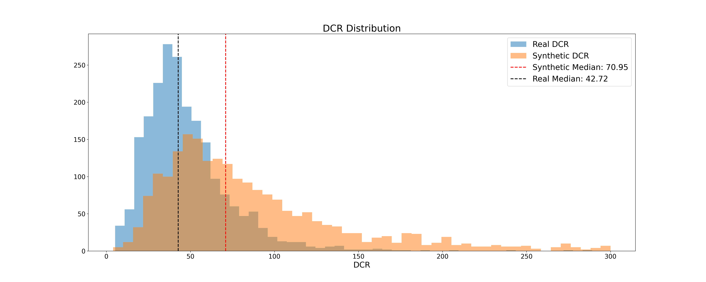

# Multivariate time series synthetic data generation
### Probabilistic Machine Learning and Deep Learning project, July 2024

Alessandro Minutolo [SM3800004](mailto:ALESSANDRO.MINUTOLO@studenti.units.it) - Emanuele Ruoppolo [SM3800049](mailto:EMANUELE.RUOPPOLO@studenti.units.it) 

## Introduction

The aim of the following work is to present a strategy for generating tabular synthetic data through the use of LLMs. The work focused on applying the framework introduced by [Language Models are Realistic Tabular Data Generators](https://arxiv.org/pdf/2210.06280) and [TabuLa: Harnessing Language Models for Tabular Data Synthesis](https://arxiv.org/abs/2310.12746) in order to deal with the generation of multivariate time series data (tabular data with a time variable).

## [Language Models are Realistic Tabular Data Generators](https://arxiv.org/pdf/2210.06280)

[Language Models are Realistic Tabular Data Generators](https://arxiv.org/pdf/2210.06280) introduced in 2023 a methodology named **GReaT** for generating tabular synthetic data using pre-trained large language models. The core of the work is to preprocess a tabular dataset, with $m$ features $f_1\dots f_m$ and $n$ rows $s_1\dots s_n$, into a set of strings $\textbf{t}=[t_i]_{i=1\dots n}$ such that:

$$ t_{i,j}= f_j \text{ is } v_{i,j} \quad \forall  i \in [1,...,n], j \in [1,...,m]$$

$$t_i = \text{``}t_{i,1}, t_{i,2},...,t_{i,m}\text{"} \quad \forall i \in [1,...,n]$$

Also, in each string, in order to prevent the model from learning any kind of positional pattern, the order of the feature-value pairs is permuted. To do this, the permutation function applies a random feature permutation $k$ to $t_i$. Considering an arbitrary $k_j \in [1,...,n]$ such that $k_j \ne k_{j'}$ for $j \ne j'$, the permutation is defined as: $$t_i(k) = \text{``}t_{i,k_1}, t_{i,k_2}, ..., t_{i,k_m}\text{"} \quad \forall i \in [1,...,n]$$

### Fine-tuning a pre-trained auto-regressive language model
 Considering a textually encoded tabular dataset $T=\{t_i(k_i)\}_{i=1,...,n}$, let $k_i$ be random permutations and $n$ the number of rows. The input sentences $t_i \in T$ need to be encoded in a sequence of tokens from a discrete and finite vocabulary $W$. Thus, $t_i \in T$ is represented by a sequence of tokens $(w_1, ... ,w_j) = \texttt{TOKENIZE}(t_i)$ with tokens $w_1, ... , w_j \in W$, where $j$ denotes the number of tokens required to describe the sequence $t_i$. The probability of having any natural-language squence is represented as a product of output probabilities conditioned on previously observed tokens, namely it is factorized in an auto-regressive manner: 

$$p(\textbf{t}) = p(w_1,...,w_j) = \prod_{k=1}^{j} p(w_k| w_1,...,w_{k-1})$$
the model is trained to output a probability distribution over possible next tokens $w_k$ from an input sequence $w_1, ..., w_{k−1}$ of arbitrary length. The entire model is usually fitted by optimizing the parameters to maximize the probability $\prod_{\textbf{t}\in T} p(\textbf{t})$ of the entire training data set.

### Sampling synthetic data 

We obtained a fine-tuned auto-regressive model $q$ of the textual training dataset that returns a categorical output distribution $z = q(w_1, ..., w_{k-1})$ over possible follow up tokens for an input sequence $w_1, ..., w_{k-1}$. Usualy, the next token $w$ is sampled by weighted choise sampling with a temperature parameter $T > 0$ from the output $z$: 

$$p(w|w_1,...,w_{k-1}) = \frac{e^{(z_w/T)}}{\sum_{w'\in W}e^{z_{w'}}/T}$$

As preconditioning we provide multiple name-value pairs $V_{i_1} = v_{i_1},...,V_{i_k} = v_{i_k}$.

By providing the textual encoding of this condition, we are able to sample from the distribution of the remaining features effectively $p(V_{ \setminus \{i_1,...,i_k\}}|V_{i_1}=v_{i_1},...,V_{i_k}=v_{i_k})$

As a result, the **GReaT** method is particularly flexible and could possibly be used in a variety of real-world problems such as missing value imputation and of course synthetic data generation.

## [TabuLa: Harnessing Language Models for Tabular Data Synthesis](https://arxiv.org/abs/2310.12746) 

**TabuLa** develops the framework provided by **GReaT** trying to increase its efficiency. In particular it proposes a new approach in:

- **Preprocessing**: as GReaT does, TabuLa makes sentences from tabular datasets and permutes them to lose the pseudo-positional order they could represent. But, instead of having such a string "$X$ is $Y$", tabula simplify the structure giving to the model sentences like "$X$ $Y$" where $X$ is the variable name and $Y$ is the value of the variable. 

- **Tokenization**: it evaluates the token lengths of all column names and values in categorical columns, simplifying these names and values to ensure they are tokenized into just one token. Column names and categorical values can be either reduced or substituted with a synonymous term. This allows the LLM to correlate them with other values. This tecnique and the different preprocessing helps token sequence length to be sharply reduced compared to **GReaT**. 
  
-  **Model choise**: Given the disparity between the pre-trained domain and the task domain, the fine-tuning on this pre-trained model may not be as efficient as expected. **TabuLa** operates on a randomly initialized LLM model devoid of prior knowledge. Omitting the word 'is' because the more concise "X Y" format is not only more efficient but also potentially simpler to learn due to its brevity.

# Our Strategy

In order to generate synthetic data for tabular time series data, we adopted the **TabuLa** framework adding a preprocessing strategy, based on temporal windows ([Tabular Transformers for Modeling Multivariate Time Series](https://arxiv.org/abs/2302.06375)). This window is built before the data get converted into text and tokenized, the data are segmented into sequence of $k$ observations, so that the model learns to predict the temporal relationship between $k$ sequential rows. We introduced $2$ parameters: sequence length, length of the window, and stride, length of the shifts of the window. Formally, given a table with $m$ rows and $n$ columns, an input $t$ is represented as a sequence of $k$ time-dependent rows:

$$t = [t_{i+1}, t_{i+2}, ..., t_{i+k}]$$

Doing so the LLM should understand the dependacy between $k$ sequential observations.

## Experimental Evaluation

In order to evaluate if the model generates optimal synthetic data, we employed the following evaluations:

- **EDA**: We confront with an accurate explanatory data analysis the real and the synthetic data. First of all by computing and visualizing the marginal feature distributions, and then computing the $\text{KL}$-divergence between the real and the sythetic marginal distributions, expecting this to be as smaller as possible. Moreover dealing with temporal data we compare the temporal trends, annual and daily where possible, expecting them to present similar patterns.

- **Discriminator measure**: merging and shuffling the synthetic data generated and the original dataset, we added a binary feature representing if the given observation is synthetic or not. We trained a Random Forest model for binary classification and we then report the test accuracy on a test data set, which contains equal shares of samples from the generated test set and the real test set. The model is expected to perform as a random classifier $\text{Acc}\simeq0.5$; a lower accuracy could report that the synthetic rows are too similar to the real ones (even copied), while an higher could report that they are too different and easily detectable.

- **Copied values counter**: since we generated sytnhetic data from a pre-existing time stamp we implemented a counter that compares the real rows with the synthetic one. For each it counted the occurences in which the value of a feature in a synthetic row was just copied from the real instance. We then plotted the results with a barplot to visualize the distribution of copied values per row.

- **Distance to closest record** (**DCR**): to verify that the generated data is similar to original samples while not being exact copies, this measure computes, given two dataframes, the distance to the closest record between the two. We compare this measure made within the rows of the original training data set $\text{DCR}(T_{\text{train}},T_{\text{train}})$ with the one computed between the original training data set and the synthetic generated dataset $\text{DCR}(T_{\text{train}},T_{\text{gen}})$. For each synthetic record $s_{\text{gen}}$, it is given by $\text{DCR}(s_{\text{gen}}) = \min\{\text{distance}(s_{\text{gen}}, s_i)|s_i \in T_{\text{train}}\}$. As a distance measure, we use the Euclidean distance, excluding the categorical variables from this computation. In the best case, all $\text{DCR}_{\text{gen}}$ scores should be non-zero and their distribution should be close to that of $\text{DCR}_{\text{real}}$. Thus we compared the medians of the two: if the two distributions are similar and the synthetic median is greater than the real one, it should mean that the generation process made the data more private than the real, since the real data is closer to itself than to the synthetic, making re-identification a difficult process.

- **Machine learning efficiency** (**MLE**): Since the generated data set should be able to replace the real data in a training process, to test the generation quality of categorical variables, this measure evaluates the performance of a discriminative model trained on the synthetic dataset and tested on the real data, comparing it with the performances of the same model trained and tested on the real data. Even if a dataset is not made for classification tasks, setting as target variable a categorical variable, being it binary or not, we expect the two discriminative models to have comparable performances. 

- **Autocorrelation within lags**: As last try we computed the autocorrelation between lags $\rho(k)$, defined as $\rho(k) = \gamma(k) / \gamma(0)$. If we indicate $x_t$ the value of a feature at time $t$, $\mu$  the mean of that feature over the time, this metric measures how a preceding value influences one that follow, if the model really understands the temporal nature of the data we should expect the same patterns in this metric between the real and synthetic data. The autocovariance $\gamma(k)$ for the $k$-th lag is:

$$\gamma(k) = \mathbb{E}[(x_t - \mu)(x_{t+k} - \mu)]$$

## Experimental set-up

The experiment started by analyzing and modifying the **TabuLa** framework provided by the original experiment [github repository](https://github.com/zhao-zilong/Tabula?tab=readme-ov-file). This framwork provides a setup that, calling by hugging face the LLM APIs, allows for generating synthetic data. It has been modified to allow temporal windows by setting the window lenght and the stride. The resulting dataset is thus as follow:

|    row    |              $f_1$                  | ... |                $f_n$               |
|:----------|:-----------------------------------:|:---:|:----------------------------------:|
|   1       |  $[v_{1,1}, v_{2,1},... v_{k+1,1}]$ |     | $[v_{1,n}, v_{2,n},... v_{k+1,n}]$ |
|   2       |  $[v_{2,1}, v_{3,1},... v_{k+2,1}]$ |     | $[v_{2,n}, v_{3,n},... v_{k+2,n}]$ |
| $\vdots$  |                                     |...  |                                    |

The data so preprocessed is then converted in strings, shuffled and tokenized. For our generation we selected as LLM the hugging face **DistilGPT-2**, a lighter version of OpenAI GPT-2, reminding that it was used without any pre training. The main model characteristics are:

- 6 layers of Transformer decoders, compared to the 12 layers in the original GPT-2. This reduces the depth of the model and the amount number of parameters, while maintaining good learning capability. DistilGPT-2 has $82.4M$ parameters, while GPT-2 $124.2M$.

- Same number of attention heads as GPT-2, which is 12. The attention heads allow the model to focus on different parts of the input text during the generation of each token. 
- Same hidden layer size as GPT-2, with 768 units. Meaning that the embedding vectors size is 768. This ensures that each layer can capture a complex representation of the text.
- Maximum length of 1024 tokens, which is the same as GPT-2. This means it can process and generate text sequences up to 1024 tokens in a single pass.

The learning process is done by using a **GeLU**(Gaussian Error Linear Units) **activation function**, a smoother version of the **ReLU**. The GeLU nonlinearity weights inputs by their percentile, rather than gates inputs by their sign as ReLU. Its sign is:

$$\text{GeLU}(x)=x\text{P}(X\leq x)=x\Phi(x)$$

where $\Phi(x)$ is the Gaussian cumulative distribution function. 

The **loss function** used by this and mainly by the LLMs is the cross-entropy loss:

$$ L_{\textrm{CE}} = \sum_{i=1}^n t_i\log(p_i) $$

where, for $n$ classes (words), $t_i$ is the truth label and $p_i$ is the softmax probabilty for the $i^{th}$ class.

As **optimizer** and AdamW from PyTorch is used. Unlike Adam, where weight decay is linked implicitly to the learning rate, AdamW decouples weight decay from the optimization process. This means that in AdamW, the learning rate and weight decay are optimized separately. Consequently, adjusting the learning rate does not require re-calculating the optimal weight decay, resulting in a more stable optimization. The parameters of the optimizer are:

|  $\textrm{lr}$     |  $\beta_1$   | $\beta_2$ |  $\epsilon$   | $\textrm{wd}$ |
|:-----------------:|:------------:|:---------:|:-------------:|:-------------:|
|  $5\cdot10^{-5}$  |     $0.9$    |  $0.999$  |$1\cdot10^{-8}$|       0       |

The training process has been performed on a GPU node V100PCIe 32GiB on ORFEO cluster, using both the modified framework on the preprocessed datasets and the original on the original datsets, comparing the results.

The experiment has been evaluated on three different public datasets from Kaggle:

- [Daily Electricity Price and Demand Data](https://www.kaggle.com/datasets/aramacus/electricity-demand-in-victoria-australia)
- [Daily website visitors](https://www.kaggle.com/datasets/bobnau/daily-website-visitors)
- [London Weather Data](https://www.kaggle.com/datasets/emmanuelfwerr/london-weather-data)

They are all based on a row-wise time sequentiality, with a column that indicates the date in a format like *DD-MM-YYYY*.

## Experimental procedure

For the modified framework we started from a random initialized DistilGPT-2, training it on the biggest dataset [London Weather Data](https://www.kaggle.com/datasets/emmanuelfwerr/london-weather-data), on 8000 of the 15000 rows. From this training a syntetic dataset was generated from $n=2500$ conditioning prompts in chronological order:

$$p_i = \text{``day }d_i, \text{ month } m_i, \text{ year }y_i \text{"}\quad\forall i\leq n$$ 

After that the trained model was finetuned on the [Daily Electricity Price and Demand Data](https://www.kaggle.com/datasets/aramacus/electricity-demand-in-victoria-australia) dataset, following the same strategy, and once the synthetic dataset generated, the resulting model was again fine-tuned on [Daily website visitors](https://www.kaggle.com/datasets/bobnau/daily-website-visitors) and used for generation. 

This process increased the data quality, as the evaluation confirms. While the extended results are reported in the [notebooks](https://github.com/eruoppolo/PML-Deep_UNITS24/tree/main/time_series_framework), here, for brevity, we present only the last fine-tuned model results.

 First we remark the generation process for testing the original framework. In order to have a baseline for our results we tested the **TabuLa** model, as originally presented, on the selected datasets. To do this we simply trained from scratch the model on each of the datasets $D$, without breaking the timestamps and creating temporal windows, and then generated synthetic data from the following chronologically ordered conditioning prompts:

$$p_i = \text{`` }d_i/m_i/y_i\text{"}\quad\forall\quad i\leq |D|$$  

This baseline served us to test how the information is carried from the variables, suposing that a time stamp so built, being unique, would sufficiently carry all the information, leading to overfitting. Breaking it instead, allows the model to analyze the relationships within the single time variables, days, months and years, and the other features, as for the modified framework an accurate analysis is provided in the github [repository](https://github.com/eruoppolo/PML-Deep_UNITS24/tree/main/original_framework), while here there is a partial amount of results.

## Experimental results

### EDA

Here we examine the results of the last-generated data of "Web" dataset. The dataset has 4 numerical features, that examine some website traffic statistics, a time feature, that indicates the timestamp, and a categorical feature ``day.of.week`` with values in [0,6] that indicates the seven week days. After preprocessing the data and fine-tuned the model, the synthetic dataset has been generated. First of all we examine the marginal distributions of the continuous variables, analyzing as comparison metric the KL divergence between the real and synthetic distribution, computed as:

$$ D_{KL}(P^{(\text{r})} \parallel Q^{(\text{s})}) = \sum_{i} p_i \log \left( \frac{p_i^{(\text{r})}}{q_i^{(\text{s})}} \right)
 $$

Where the indices $(\text{r})$ and $(\text{s})$ indicate the *real* and *synthetic* datasets.

We see that the disributions seem to be comparable, meaning that the model has been able to understand and reproduce the features behaviors, also the divergences are:

|  |  page.loads  | unique.visits |first.time.visits |returning.visits |
|-----|:------:|:---------:|:---------:|:---------:|
| $KL_{p\parallel q}$ | $0.29$ |   $0.29$  | $0.08$  |$0.10$  |

We then compared the temporal behavior within the real and the synthetic data, to check if it was respected or not. First we see the behavior within a 3 years range. We see that even not replicating the real values, the synthetic data seems to behave as the real, showing to increase and to decrease when the original data do.

We then inspected the daily trends for each of the variables and each of the week days. Since the dataset provided a variable for days we analyzed the trend trough the years given a day of all the variables. Here we see two of them and looking at the plots we can see that the syntetic data behaves as the original for all the features, meaning that somehow the model understood the daily patterns and was able to replicate them.

As the previous plots suggests the model is able to understand the patterns within the week days. The following barplots confirms this. Here we are representing the averages values for each of the variables, day by day. We see the synthetic data well describes the behavior of the variables within the days.

These barplots show a wider sight on the distributions of all the variables day by, day, showing the coherence between the real and synthetic variables not only for the mean values but also for the other distributions statistics.

### Copied values

We saw that the sytnetic data seems to have the same characteristics of the real ones, with similar distributions and temporal behaviour. This could be due to a mere copy of the real data, we then want to ensure that the syntetic data geenration gone well. To do this as first isnight we provide a barplot that show the number of copied values per row. To build this the real and synthetic datasets common rows (with same timestamp) have been compared, and the equal feature-value pairs have been counted. We see that applying the time-wise framework almost $99\%$ of the rows have no common values, while only abuot $1\%$ of the rows have just one common value. 

On the contrary the generation made with the original framework showed an amount of about $25\%$ of the rows with almost one common value, and the half of these, $13\%$ have four common values. 

These results highlight the improved data quality, showing how the time-wise generation ensures more privacy making re-identification not easy.

### Distance to the closest record (DCR)

To quantify the similarity between synthetic data and original data, we use a distance to closest record (DCR) calculation. This method involves two steps:

1. **Calculating the Euclidean Distance for Original Data**: For each datapoint in the original dataset, we calculate the Euclidean distance to its nearest neighbor within the same dataset.

2. **Calculating the Euclidean Distance for Synthetic Data**: For each synthetic datapoint, we calculate the Euclidean distance to the closest datapoint in the original dataset.

A greater synthetic-real DCR indicates that the synthetic datapoint is more distinct from the real datapoint, suggesting higher privacy since re-identification is more difficult. Conversely, a synthetic-real DCR close to 0 means that the synthetic datapoint closely resembles a real datapoint, offering little to no privacy protection.

Interpreting synthetic-real DCRs can be challenging because synthetic data points are designed to fall within the same range as the original data, increasing the likelihood of proximity to a real record. To address this, we compare the distribution of distances between synthetic records and real records with the distribution of distances among real records themselves. If the synthetic data is similar or farther from the real data compared to the real data's internal distances, it implies that the synthetic data provides good privacy and is not merely a copy or simple perturbation of the real data.

Here we compare the DCR distribution of the time-wise framework generated data (first image) with the one generated from the original framework. We see how the syntetic distribution median moves from $m_s=21$ to $m_s=70$, being the real $m_r=43$ with all the previous results this means that the synthetically generated data guarantee privacy, being not only a perturbation of the real data but a re-generated set that shares the real data characteristics while not merely copying them.

### Discriminator and Machine Learning efficiency metrics

Here we present two other metrics useful for the data quality evaulation:

- **ML discriminator**: this metric tries to detect synthetic data, in order to evaluate if these present any pattern that a ML model would find. It is implmented as a RandomForest classifier, the datasets have been labeled as `Real: 0` or `Synthetic: 1`, then merged and shuffled. On the merged dataset a static train-test-split has been applied.
- **Machine learning efficiency** (**MLE**): this metric compares the performaces, in terms of efficiency, of a simple machine learning model on the data, analyzing the efficiency of synthetic data with respect to the real ones. To do this the model is trained on the synthetic data and tested on the real. Its accuracy is then compared to the accuracy of the model when trained and testd on the real data. As model we use a simple ``RandomForest`` classifier, using as target variable ``Day.Of.Week``.

We see that the results coming from the time wise framework confirm its worth. The discriminator has performances comparable with those of a random classifier, while in the original framework they are lower, meaning that the synthetic data and the real data are similar, even the same, as we saw above. Regarding MLE, the time-wise framework shows similar performances in all the cases. We specify that both weather and web dataset were not made for classification, thus the accuracy performances are pretty low. Anyway the models trained on real and synthetic data performs in a similar way, confirming that the syntetic data can replace the real ones without loosing efficiency. We see instead that in the original data the MLE is higher for Synthetic-Real train-test. This could denote that the synthetic data, since they are too similar to the real one, they can improve the classification performance showing in the training phase to the model the same data it classifies in the test phase.
### Time-wise framework
|               | Weather | Energy |   Web  |
|---------------|:-------:|:------:|:------:|
| Discriminator |  $0.59$ | $0.56$ | $0.63$ |
| MLE S-R       |  $0.31$ | $0.63$ | $0.28$ |
| MLE R-R       |  $0.29$ | $0.73$ | $0.28$ |
### Original framework
|               | Weather | Energy |   Web  |
|---------------|:-------:|:------:|:------:|
| Discriminator |  $0.42$ | $0.34$ | $0.37$ |
| MLE S-R       |  $0.37$ | $0.77$ | $0.53$ |
| MLE R-R       |  $0.29$ | $0.73$ | $0.28$ |

### Autocorrelation

The last results we present deal with the autocorrelation metric. We report the autocorrelations within 4 lags of some of the variables. Here we see that our model fails. Indeed, while the model is able to simulate the real data ensuring the same statistics and a good level of privacy, this metric shows that it is not able to understand the real data sequential nature. The autocorrelation within a lag and the followings is constant and does not folow the real pattern. This is clearly due to the generation process, that is done indepentently for each of the rows without really conditioning it on the previous generated values. Thus even if the model can reproduce the time dependant behavior of the system, it does not learn its deep nature, but only simulates its punctual behavior thanks to the windowing that makes possible to understand a possible range of values given the others.
### page.loads autocorrelation
| Lag |  Real  | Synthetic |
|-----|:------:|:---------:|
| $0$ | $1.00$ |   $1.00$  |
| $1$ | $0.74$ |   $0.30$  |
| $2$ | $0.35$ |   $0.33$  |
| $3$ | $0.14$ | $0.29$    |
| $4$ | $0.13$ | $0.29$    |
### first.time.visits autocorrelation
| Lag |  Real  | Synthetic |
|-----|:------:|:---------:|
| $0$ | $1.00$ |   $1.00$  |
| $1$ | $0.76$ |   $0.33$  |
| $2$ | $0.40$ |   $0.36$  |
| $3$ | $0.20$ | $0.31$    |
| $4$ | $0.10$ | $0.31$    |
### unique.visits autocorrelation
| Lag |  Real  | Synthetic |
|-----|:------:|:---------:|
| $0$ | $1.00$ |   $1.00$  |
| $1$ | $0.76$ |   $0.31$  |
| $2$ | $0.37$ |   $0.32$  |
| $3$ | $0.17$ | $0.28$    |
| $4$ | $0.16$ | $0.28$    |
